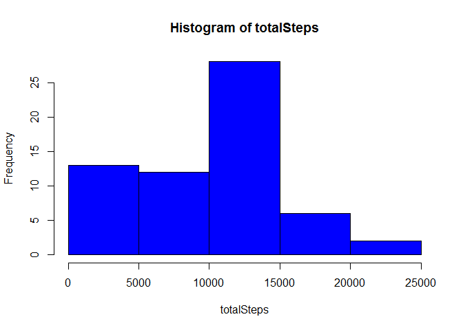
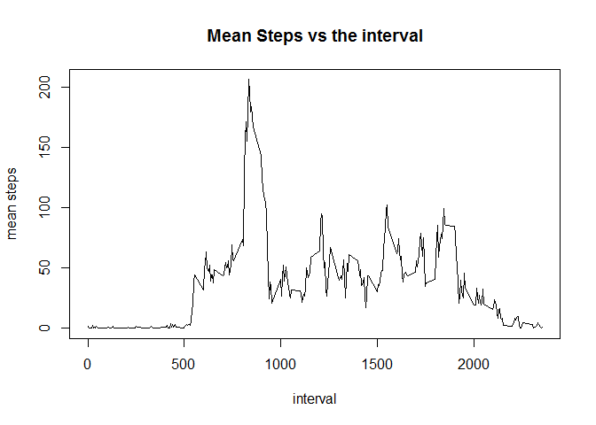
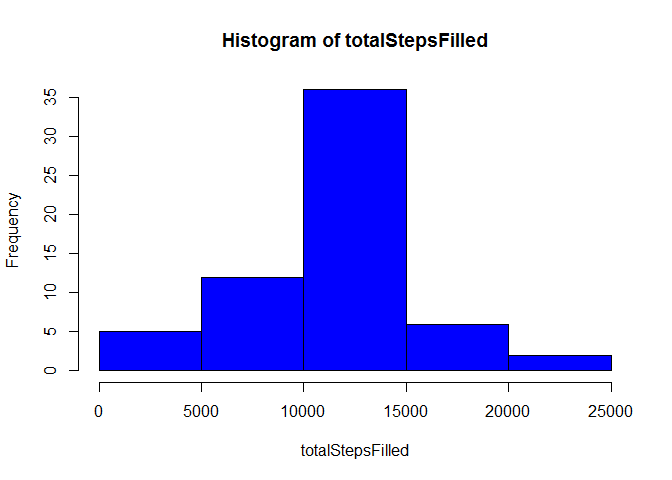
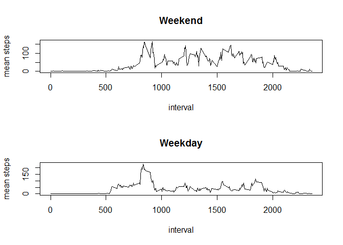

# Reproducible Research: Peer Assessment 1


## Loading and preprocessing the data


```r
unzip('activity.zip')
activity <- read.csv('activity.csv')
activity$date <- as.Date(activity$date, '%Y-%m-%d')
```


## What is mean total number of steps taken per day?

```r
days <- split(activity, activity$date)

totalSteps <- sapply(days, function(day){
  sum(day$steps, na.rm=T)
})

hist(totalSteps ,col="blue")
```

 

```r
meanTotalSteps <- mean(totalSteps)

medianTotalSteps <- median(totalSteps)
```

The mean total Steps per day is 9354.2295
The median Total Steps per day is 10395


## What is the average daily activity pattern?

```r
intervals <- split(activity, activity$interval)

apMeanSteps <- sapply(intervals, function(interval){
  mean(interval$steps, na.rm=T)
})

plot(as.numeric(names(apMeanSteps)) , apMeanSteps, type="l", xlab="interval", 
     ylab="mean steps", main="Mean Steps vs the interval")
```

 

```r
maxSteps <- max(apMeanSteps)
maxStepInterval <- names(apMeanSteps[which(apMeanSteps==maxSteps)])
```
The Interval with the maximum number of steps is 835

## Imputing missing values
We will fill in the missing values with the corrsponding 5 minute interval mean.


```r
rowsWithNa <- sum(!complete.cases(activity))
intervalMean <- data.frame(interval=names(apMeanSteps), mean = apMeanSteps )

activity2 <- activity
for (a in 1:nrow(activity2)){
  if(is.na(activity2[a,]$steps)){
    activity2[a, ]$steps <- intervalMean[intervalMean$interval == activity2[a, ]$interval, ]$mean
  }
}


days <- split(activity2, activity2$date)

totalStepsFilled <- sapply(days, function(day){
  sum(day$steps)
})

hist(totalStepsFilled ,col="blue")
```

 

```r
meanTotalStepsF <- round(mean(totalStepsFilled))

medianTotalStepsF <- round(median(totalStepsFilled))
```


The number of missing values in data set is ` r rowsWithNa`
The mean total Steps per day is 1.0766 &times; 10<sup>4</sup>
The median Total Steps per day is 1.0766 &times; 10<sup>4</sup>

The imputing increases the mean and median of total daily steps.

## Are there differences in activity patterns between weekdays and weekends?


```r
inWeekend <- weekdays(activity2$date) %in% c("Saturday", "Sunday")
activity2$type <- 'Weekday'
activity2[inWeekend,]$type <- 'Weekend'

weekendActiv <- activity2[inWeekend, ]
weekdayActiv <- activity2[!inWeekend, ]


intervals <- split(weekendActiv, weekendActiv$interval)

apMeanStepsWeekend <- sapply(intervals, function(interval){
  mean(interval$steps, na.rm=T)
})

WeekendInterval <- as.numeric(names(apMeanSteps))


intervals <- split(weekdayActiv, weekdayActiv$interval)

apMeanStepsWeekday <- sapply(intervals, function(interval){
  mean(interval$steps, na.rm=T)
})

WeekdayInterval <- as.numeric(names(apMeanSteps))

par(mfrow = c(2, 1))

plot( WeekendInterval, apMeanStepsWeekend, type="l", xlab="interval", 
     ylab="mean steps", main="Weekend")

plot( WeekdayInterval, apMeanStepsWeekday, type="l", xlab="interval", 
     ylab="mean steps", main="Weekday")
```

 
